## Targets

### Imatge 1: Vista inicial del projecte
En aquesta primera captura es veu el punt de partida del treball, amb l'estructura bàsica del repositori i la ubicació dels fitxers que s'han d'utilitzar.

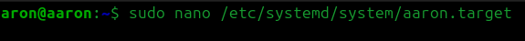

### Imatge 2: Exploració de la carpeta `ASO`
Aquí es mostra com s'ha revisat el contingut de la carpeta del projecte per identificar els elements necessaris per al desenvolupament i la documentació.

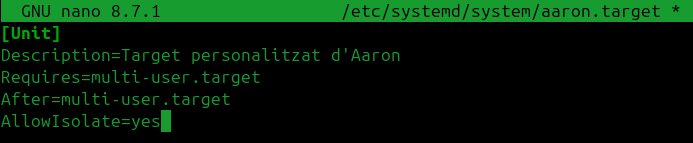

### Imatge 3: Localització de les imatges
En aquesta imatge es confirma que la carpeta `imatges` conté els captures que després s'incorporaran al document final.

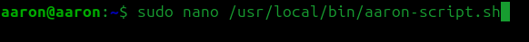

### Imatge 4: Revisió de fitxers disponibles
Es visualitza la llista de documents del projecte, cosa que permet tenir una visió general de les parts que formen la tasca.

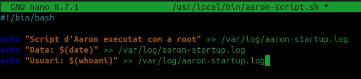

### Imatge 5: Identificació del fitxer principal
Aquí es localitza el document principal on s'ha d'inserir la documentació i les captures del procés realitzat.

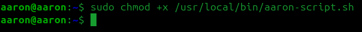

### Imatge 6: Preparació del document `SP1.md`
La captura mostra la preparació del fitxer de treball, abans d'inserir les imatges i redactar la explicació corresponent.

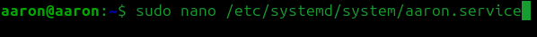

### Imatge 7: Inserció de contingut visual
En aquest moment s'està incorporant al document el material gràfic que explica el desenvolupament pas a pas.

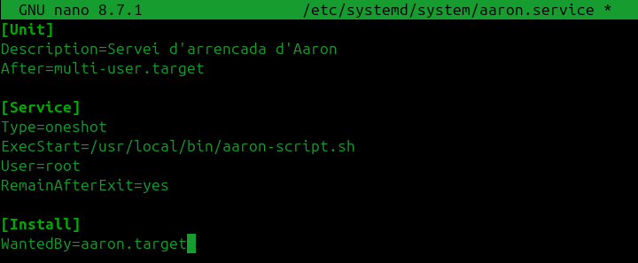

### Imatge 8: Estructuració del document
Es veu com la documentació es va ordenant en apartats per facilitar la llegibilitat i la comprensió del treball.

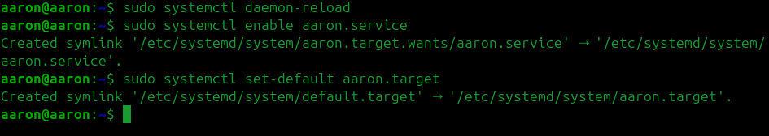

### Imatge 9: Continuació del procés de documentació
Aquesta imatge mostra la part següent de la feina, on es va completant la informació del projecte amb captures i descripcions.

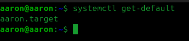

### Imatge 10: Control de la feina realitzada
Es reflecteix el seguiment del procés, comprovant que cada pas del treball ja està documentat i organitzat.

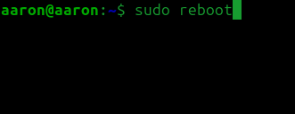

### Imatge 11: Verificació del contingut
En aquesta captura es revisa que totes les imatges i textos estiguin correctament ubicats dins del document final.

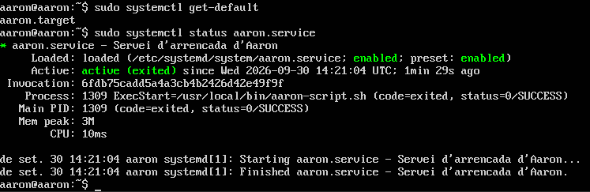

### Imatge 12: Revisió final del material
Es comprova que la documentació té el contingut necessari abans de donar-la per acabada.

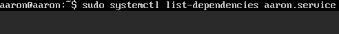

### Imatge 13: Document quasi finalitzat
Aquesta imatge mostra un estat avançat del treball, amb la major part del contingut ja incorporat i ordenat.

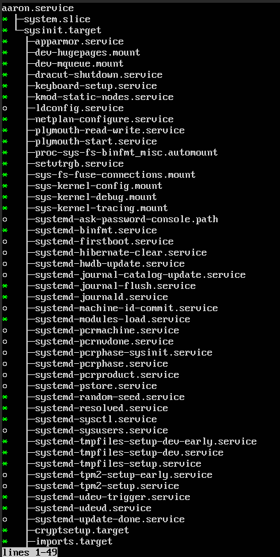

### Imatge 14: Document final
La captura final representa el resultat del procés: un document amb totes les captures i una explicació clara del que s'ha fet.

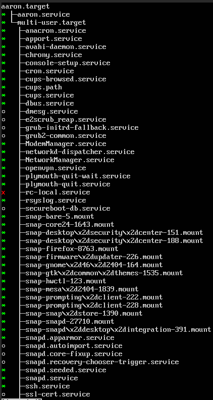
